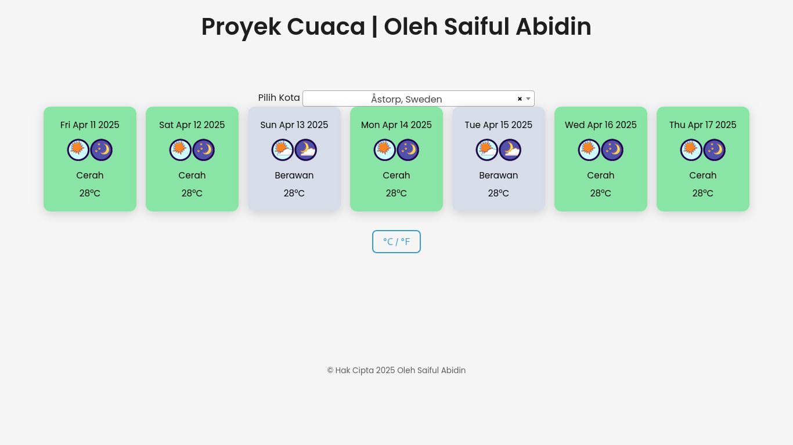

# 🌤️ Cuaca Ceria

[](https://app.netlify.com/sites/weather-checker-eu/deploys)

Aplikasi prakiraan cuaca harian berbasis JavaScript dan API dari [7timer.info](http://7timer.info).\
Mudah digunakan, responsif.
[🔗 Live Demo](https://weather-checker-eu.netlify.app/)
---
## ✨ Fitur
- ✅ **Dropdown kota** dengan pencarian (Select2)
- ⏳ **Loader** saat ambil data cuaca
- 📦 **Data cuaca 7 hari ke depan** (via API)
- 🎨 **Kelas warna otomatis** sesuai cuaca
- 📱 **Responsif & ringan**
- ⚙️ **Fallback** untuk data/error & ikon
---
## 🧪 Teknologi
- HTML, CSS (dengan Transisi)
- Vanilla JavaScript
- [Select2 Dropdown](https://select2.org/)
- [7timer.info API](http://7timer.info)
- Deploy: [Netlify](https://www.netlify.com/)
---
## 🔧 Struktur Folder
```
.
├── index.html
├── js/
│   └── main.js
├── css/
│   └── master.css
├── images/
│   └── [ikon-cuaca].png
├── city_coordinates.csv
├── README.md
```
---
## 📸 Cuplikan

---
## 🧑‍💻 Pengembang
**Saiful Abidin**  
📫 GitHub: [@saifulabidin](https://github.com/saifulabidin)
---
## 📄 Lisensi
Proyek ini dirilis dengan lisensi **MIT**.
